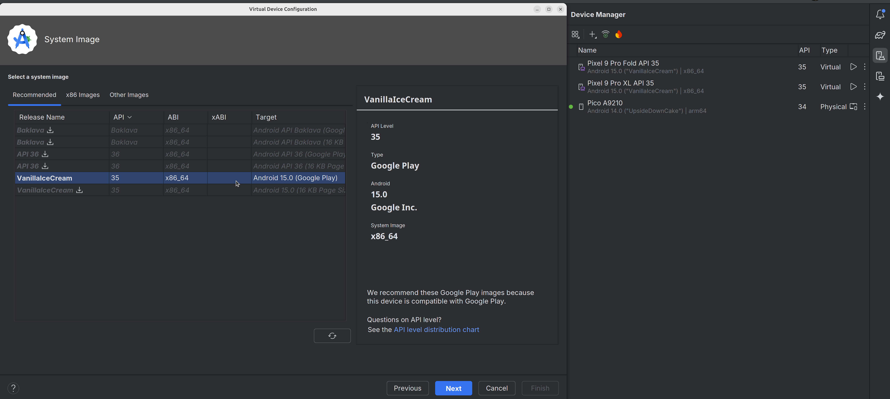

# OS Rendering Service Made Parallel with Out-of-Order Execution and In-Order Commit [OSDI '25]

## Introduction
Rendering service is an indispensable OS service on smart-device OSes like Android, iOS and OpenHarmony. 
However, the recent shift towards highly scalable display scenarios, such as foldable and multiple screens, has notably amplified the rendering workload, leading to low frame rates that degrade user experience. 

We introduce **Spars**, a <u>s</u>calable <u>pa</u>rallelized OS <u>r</u>endering <u>s</u>ervice inspired by the out-of-order execution with in-order commit in computer architecture. 
*Spars* revolutionizes the rendering procedure by initially generating self-contained rendering tasks through in-order preparation, executing such tasks in an out-of-order manner to maximize multi-core parallelism, and subsequently committing the tasks in-order to enforce drawing order dependencies. 

*Spars* can reduce the end-to-end CPU frame rendering time (thus improve the average frame rate) by 1.76×–1.91×. 
*Spars* is also able to decrease the device power consumption by 3.0% or increase the budget of graphics primitives by 2.31× for more appealing visual effects with the same stable frame rate.

## Getting Started

### Overview
This artifact demonstrates the proof-of-concept three-stage parallelization design of **Spars**, which consists of in-order preparation, out-of-order execution, and in-order commit. All the details discussed in the paper are implemented. 
The repository also includes a **Sequential** baseline for comparison with *Spars*.

We ported the artifact as a self-rendering android project that directly uses Vulkan and bypasses the vanilla rendering service in Android, so it can run on **any non-rooted commercial Android smartphone**. 
The performance gain should be identical, with some manual setup needed for different smartphone configurations (see instructions below). 
We recommend flagship smartphone models from 2023 or later for doing the artifact evaluation, such as the Huawei Mate and Pura series, Samsung Galaxy series, Xiaomi series, Oppo Find series, Google Pixel series, etc., that feature at least 8 CPU cores and support Vulkan.

### Project Structure
- ``README.md``: this file.
- ``Spars/``: source code of the **Spars** parallelization design.
- ``Sequential/``: source code of the **Sequential** baseline.

**Spars** and **Sequential** have similar internal file structures:
- ``prf/``: an Android project that can be opened in Android Studio.
- ``prf/app/src/main/cpp``: where the core source code locates.
- ``prf/app/src/main/assets``: assets for the rendering, including render tree structures and dummy images.
- ``prf/app/src/main/cpp/config.h``: some configurations to evaluate the artifact. **You may need to modify this file manually before running different tests.**

### Compile and Run
**WARNING: Please follow the steps below using the exact same package versions. Otherwise, there might be compilation and dependency errors.**

1. Download the latest Android Studio (Windows/Ubuntu/Mac) at https://developer.android.com/studio (If you are in China, you may need stable VPN/proxy for Android Studio downloading and Gradle dependency downloading when building the projects in Android Studio)
2. Inside Android Studio, open and import the ``prf/`` project (in ``Spars/`` or ``Sequential/``). The importing and indexing may take several minutes.
3. In Android Studio, 
    - Please set Gradle to version 7.3.3 (In the top navigation bar, File->Project Structure)
    
    - Please set Gradle JDK to version jbr-17 (File->Settings->Build,Execution,Deployment->Build Tools->Gradle). The downloading may take several minutes.
    
    - Please install CMake 3.18.1 (File->Settings->Languages&Frameworks->Android SDK->SDK Tools, select "Show Package Details" to install 3.18.1)
    

4. Build the project again.

5. You can run the project in Android Studio built-in emulator for functionality testing. Please use **Pixel 9 Pro Fold API 35**. For some reason, API 36 may not work. (**Note that you must run the program on actual smartphones for meaningful performance testing, as emulators do not have real parallelism.**) You can download the "Pixel 9 Pro Fold API 35" image in the Device Manager window in Android Studio.


6. When re-running the program for another configuration (e.g., another render tree or another CPU binding), please **stop the program first by clicking the red squared button, wait for several seconds, and then run the program again**, rather than directly clicking the re-run button. This ensures that all vulkan objects are cleanly freed and recreated. Otherwise, some content may not get correctly displayed. (In real OSes, rendering service is a continuously running process, and never gets re-run.)
7. For different experimental configurations, please modify ``prf/app/src/main/cpp/config.h``. Specifically:
    - You can modify the ``RS_TREE_PATH`` for different scenarios stored in ``prf/app/src/main/assets/RSTree``. The experimental results of these scenarios are reported in Figure 11 of our paper.
    - Because the scenarios are designed for the screen sizes of Huawei Mate 70, Mate X5, and Mate XT, they may not fit for other devices. You may modify the ``DIVIDE_BY`` macro to make the content fit inside your device screen. The ``DIVIDED_BY`` value is intended to make visualization more convenient and does not affect any performance.
    - For **Sequential**, ``SEQ_BIND_CPU`` specifies the CPU core to bind the sequential rendering workload.
    - For **Spars**, ``RENDER_THREAD_COUNT`` specifies the number of worker threads (i.e., render threads) to use, usually 3 to 5.``MAIN_THREAD_CORE`` specifies the CPU core to bind the main and commit thread.
8. To use a real smartphone, use a USB cable to connect the phone with your computer.
    - In your smartphone, please turn on the developer mode (please Google how), and allow the USB debugging.
    - Select your physical smartphone and run.
    
9. **Troubleshooting:** If you successfully build and run one project (e.g., Sequential) but fail in another (e.g., Spars), it's probably because you are not really building the second project. Every time you click the run button, it's still the first project. You should use two Android Studio windows for Sequential and Spars. You can check the running and building target at the left of the green run button. Also, you can directly go to the ``MainActivity.java`` at ``prf/app/src/main/java/com/android/prf/MainActivity.java``, right click the file, and click ``Run 'MainActivity'``. If it still fails for the second project, you can always File->Invalidate Caches, and then File->Reload All from Disk, and rebuild the second project from scratch. 

### Get a Trace
1. When running *Spars* or *Sequential* on a real physical smartphone, we can use the android studio built-in profiler to capture a runtime trace. The trace will later be used to evaluate the frame rendering time, CPU utilization, etc. If you don't see the Profiler window tab at the bottom panel, then in the top navigation bar, click Run->Profiler: Run 'app' as profileable (low overhead) -> Profiler: Run 'app' as debuggable (complete data). In the Profiler window, select the process ``com.android.prf`` and the option ``Capture System Activities``, and then click ``Start profiler task``. 

2. Run the profiling for **20 seconds**, before clicking the stop button.
3. We do not use the android studio built-in trace viewer to examine our captured trace. Instead, we use the perfetto browser version. In any browser, open https://ui.perfetto.dev/
4. In Android Studio profiler window, select ``Past Recordings`` and export the recording to any location you wish.

5. In Perfetto, click ``Open trace file`` and open the .trace file. Use the key ``w`` ``a`` ``s`` ``d`` to move and zoom.
6. In ``com.android.prf`` process, you could find the runtime trace details. We use the ``EndToEndDuration`` trace to measure the end-to-end frame rendering time of a specific frame. For example, in *Sequential*:

7. In non-rooted commercial smartphones, we can only pin (or suggest the scheduler about) our workload on specific CPU cores (hopefully it works for most smartphones), but it is impossible for us to override the default OS DVFS (dynamic voltage and frequency scaling) and control the core frequency. Therefore, the frame rendering time is highly dependent on the CPU core frequency (If the core frequency is doubled, the frame rendering time is basically halved). **Fortunately, in Perfetto, we can see the CPU core frequency of a specific frame**. In the topmost rows:

8. In Perfetto, you can pin the rows (traces) you want to the top for easier navigation, by simply clicking the row at the pin-shaped button position, as shown in the above image.

## Detailed Instructions
In this section, we aim to
- Give a brief introduction of our code, showing that all the key components described in the paper are included **(Artifact Functional Badge)**, specifically:
    - In-order preparation
    - Out-of-order execution
    - In-order commit
    - Stateless and thread-safe 2D engine
- Obtain the main results reported in the paper **(Results Reproduced Badge)**, specifically:
    - End-to-end CPU frame rendering time can be reduced by 1.76×–1.91×, as shown in Figure 11 in our paper.
    - The results (frame rendering time reduction) can be generalized to different cores and core frequencies, as shown in Figure 12.
    - The CPU core utilization is more balanced, as shown in Figure 14.
    - Scalability of graphics primitive count, as shown in Figure 15(b).

### Code Introduction (Artifact Functional Badge)
- The function ``bool VulkanDrawFrame(android_app *app)`` in ``Spars/prf/app/src/main/cpp/VulkanMain.cpp`` contains the complete logic of every frame.
    - It first acquires a Vulkan image (i.e. frame buffer) for the frame to render into.
    - It executes registered animations to animate the render tree.
    - It generates rendering tasks from the tree by calling ``drawTaskList.generateFromRenderTree(rootNode);`` (**In-order preparation**).
    - It calls ``renderWorkerPool.renderAll(deviceInfo, swapchainInfo, renderInfo, nextIndex, &drawTaskList);`` for doing the rendering (**Out-of-order execution and In-order Commit**).
    - It submits the vulkan command buffer to the GPU driver.
- **In-order preparation** applies a dry run to generate self-contained tasks from the render tree for the worker threads to execute. The self-contained tasks are defined at ``engine2d/DrawTask.h``. The dry run is implemented at the function ``void DrawTaskList::generateFromRenderTree(RenderNode *rootNode)`` in ``drawTaskContainer/DrawTaskList.cpp``.
    - As discussed in the paper, the *in-order preparation* chains the tasks (``std::vector<std::shared_ptr<DrawTask>> drawTasks_;`` in ``drawTaskContainer/DrawTaskList.h``) and manage their AABBs (``Rect boundingBox_;`` in ``engine2d/DrawTask.h``) for the **overlapping relations**.
    - The draw command batching algorithm is implemented in ``bool DrawTaskList::batchDrawCmdWithDrawTasks(DrawCmd *drawCmd, RenderNode *renderNode)``.
    - The generated self-contained tasks are then put into **a Single-Producer Multiple-Consumer (SPMC) task pool**, defined at ``Spars/prf/app/src/main/cpp/utils/DrawTaskPool.h``.
    - All tasks are put into the SPMC pool and all the worker threads are notified, in the function``void DrawTaskPool::reset(DrawTaskList *drawTaskList)``.
- **Out-of-order execution** happens in the worker threads, defines at ``Spars/prf/app/src/main/cpp/renderWorker/RenderWorkerThread.cpp``.
    - The worker threads consume self-contained tasks from the SPMC pool, and then execute each task by calling ``std::shared_ptr<DrawResource> drawResource (new DrawResource(drawTask->draw()));``. Each ``drawTask`` has its own implementation of the ``draw()`` function and generates the corresponding GPU resources (handles). 
    - ``engine2d/Engine2D.h`` lists all the stateless drawing functions of the **Spade2D** drawing engine.
    - The GPU resources are packed into the ``engine2d/DrawResource.h`` object, and then sent to **a Multiple-Producer Single-Consumer (MPSC) resource pool**, defined at ``utils/DrawResourceCollectorQueue.h``.
- **In-order commit** also takes place at the ``void RenderWorkerPool::renderAll(...)`` function. Because the main thread and the commit thread do not overlap in time, we use the same physical thread in our artifact. The core *chain and AABB checking logic* is in ``drcqOut_.consume();`` which then calls ``bool DrawResource::canCollect(uint32_t currTaskDone, DrawTaskList *drawTaskList)``.
- **Stateless and thread-safe 2D engine** (i.e., **Spade2D**) is implemented in the folder ``engine2D/``.      
    - Let's consider drawing an image for an example. The function is ``DrawResource Engine2D::drawImage(Image &image, Paint &paint)``. It takes the drawing information and style as inputs, and outputs the ``DrawResource``.
    - Different managers in ``engine2D/`` manage different vulkan objects, for example, all the ``VkImage``s are managed by the ``ImageManager.h``.
    - The following code snippet in ``ImageManager.h`` shows how Spade2D guarantees **thread-safety** and **prevents resource double creation**.
    ```cpp
    std::shared_mutex mutex_; // use a shared mutex to protect the following maps
    std::condition_variable_any cv_; // guarantees that only one task is creating a resource
    std::unordered_map<Image, VulkanImageInfo, ImageHash> imageMap_; // created (prepared) resources
    std::unordered_map<Image, bool, ImageHash> preparingMap_; // all the preparing resources (images) to prevent resource double creation caused by parallelism
    ```

### Results Reproduction (Results Reproduced Badge)
- Target 1: End-to-end CPU frame rendering time can be reduced (i.e., frame rate can be improved) by 1.76×–1.91×
    - Because you are doing the evaluation on your own commercial smartphones and possibly different SoCs and CPU frequencies, you may observe frame rate improvement (frame rendering time reduction) anywhere from 1.5×–2.7×. Please see section 6.2 in our paper for the theoretical speedup analysis. This is normal, and shows that **Spars** has significant performance enhancements on different smartphones/SoCs.
    - In the configuration file ``config.h`` for both **Spars** and **Sequential**, set:
    ```cpp
    #define RS_TREE_PATH "RSTree/services-X5.txt"
    ```
    - For **Sequential**, bind the workload to a medium core (different smartphones may differ here):
    ```cpp
    #define SEQ_BIND_CPU 4 // In Huawei Mate Series, CPU 4 is a medium core
    ```
    - Run **Sequential** on your smartphone and capture a trace for 20 seconds as discussed in the *Get a Trace* section.
    - View the trace in Perfetto
    - Because in non-rooted smartphones, we cannot set the CPU frequency to a static value, the DVFS dynamically adjusts the CPU frequency, and different frames running at different CPU frequencies have varying frame rendering time:
    
    
    - This is problematic. To illustrate the frame rate gain of **Spars**, we need to keep the CPU frequency a constant value for both **Sequential** and **Spars** for a fair comparison. Therefore, to circumvent the issue, in this artifact evaluation, we choose to manually pick a frame that runs at a specific frequency. In the figure below, for **Sequential**, we find a frame that **runs entirely on CPU 4 with 0.869GHz**. In our paper, we report data on the medium core with roughly 0.7GHz. Thus, 0.869GHz should be close enough. It may take some time to find such a specific frame. You should find a frame that runs **entirely** at your picked frequency, with no frequency change in the middle.
    
    - Record the ``EndToEndDuration``. Here, this frame runs for **10.052ms**. 
    - Now, it's for **Spars**. In the **Spars** project, set the ``config.h``:
    ```cpp
    #define RENDER_THREAD_COUNT 5 // Spars with 5 worker threads, a.k.a., Spars-5
    #define MAINTHREAD_CORE 9 // pin the main/commit thread to core 9 (a medium core). You may change this value depending on your smartphone SoC.
    ```
    - Try to pin the worker threads as well on medium cores, so both ``Sequential`` and all threads of ``Spars`` run on medium cores and we will have a fair comparison. The following code in ``Spars/prf/app/src/main/cpp/renderWorker/RenderWorkerThread.cpp`` tries to do that:
    ```cpp
    int affinityArray[9] = {4, 6, 5, 7, 8, 0, 1, 2, 3};

    // bind thread to specific cores
    void set_thread_affinity(uint32_t worker_id) {
        cpu_set_t cpuset;
        CPU_ZERO(&cpuset);
        CPU_SET(affinityArray[worker_id], &cpuset);

        int result = sched_setaffinity(0, sizeof(cpu_set_t), &cpuset);  // set affinity
        if (result != 0) {
            LOGE("fail to set affinity %d!", affinityArray[worker_id]);
        } else {
            LOGI("worker %u binds to core %d", worker_id, affinityArray[worker_id]);
        }
    }
    ```
    - The first five worker threads will attempt to pin on core 4, 6, 5, 7, 8, respectively. All of them are medium cores in Huawei Mate Series. You may change the core ID in the ``affinityArray`` based on your own smartphone SoC. This affinity pining is only a suggestion for the scheduler and may not always succeed on all smartphones. If you do not have 5 medium cores, you can play with ``#define RENDER_THREAD_COUNT 3``, that is, **Spars-3**, or use heterogeneous core configurations. The results (performance gains) might be slightly different.
    - Now, run our configured **Spars-5** and record a 20-second trace.
    - View the trace in Perfetto, and find a frame that **all threads run entirely at the picked frequency (0.869GHz)**. Usually, in **Spars**, the QoS-guided DVFS makes the overall CPU frequency much lower (please see section 6.5 in our paper, about power consumption reduction). Therefore, it may take some time to find such a frame:
    
    - Here, the ``EndToEndDuration`` is 5.096ms. Compared to **Sequential** (10.052ms), **Spars-5** in this example reduces the frame rendering time by 49.3%, and thus the frame rate could be improved by 1/(1-0.493) = 1.97x. 
    - We release some of the pages we constructed in the folder ``Spars/prf/app/src/main/assets/RSTree``. You can play with them and use different configurations of **Spars** by modifying ``config.h``.
- Target 2: The results (frame rendering time reduction) can be generalized to different cores and core frequencies.
    - Similar to Target 1, you can pick different cores and core frequencies, and compare the frame rendering time of **Sequential** and **Spars** (the core frequency should still be the same for **Sequential** and **Spars** frame pair, for a meaningful comparison).
    - You can reproduce the results in Figure 12 in our paper. Note that in Huawei Mate phones, the SoCs only have 4 little cores, so **Spars-5** on little cores cannot be reported. You can choose the specific cores and core frequencies based on your own smartphone SoC.
- Target 3: The CPU core utilization is more balanced, as shown in Figure 14 in our paper.
    - The second paragraph in section 6.4 of our paper discusses the testing configurations. Specifically, we record traces for **Spars-3mid**, **Spars-5mid** and **Spars-5mid&3little** by modifying ``config.h``.
    - Again, **we need the frames to be in the same CPU core frequency for the evaluation to be meaningful**. Thus, you could pick a frequency (around 0.7GHz) and find such a frame in each trace.
    - As shown in Figure 14 of our paper, we would like to show that the CPU utilization of the most utilized core is reduced.
    - CPU utilization could be measured by highlighting the entire area of a specific CPU track using the mouse:
    
    - In this example, CPU 9 is the most utilized core (for the main/commit thread), so we highlight all its workloads in the frame. As shown in the bottom, the total ``Wall duration (ms)`` is 4.746ms. 
    - In our paper, we measured the CPU utilization under the frame rate of 90Hz, that is, a 11.11ms period for each frame to render. Therefore, the CPU utilization can be derived by 4.746/11.11 = 42.7%, which is consistent with the value (45% for Spars-5mid) we reported in Figure 14 of our paper. Here, all workloads run at the CPU frequency 0.869GHz.
    - The same experiment can be conducted again for **Spars-3mid** and **Spars-5mid&3little**, and it's important to pick the frames under the same CPU frequency and compare their results.
- Target 4: **Spars** provides scalability of graphics primitive count, as shown in Figure 15(b).
    - In ``Spars/prf/app/src/main/cpp/VulkanMain.cpp`` line 183, you could uncomment the following line to replace the render tree with random graphics primitives, defined by the function ``testRenderTree()``.
    ```cpp
    rootNode = treeParser.parse(app, RS_TREE_PATH, width, height, &animationsList);
    //  rootNode = testRenderTree(); // uncomment this line
    ```
    - In ``testRenderTree()``, you could use the for-loop to control the number of randomly generated graphics primitives (here, 700).
    ```cpp
    for(int i = 0; i < 700; i++) 
    ```
    - You could measure the ``EndToEndDuration`` of rendering 700 graphics primitives, in **Sequential**, **Spars-3**, and **Spars-5**. Again, the frames need to be in the same CPU core frequency.
    - You could also try to change the number of randomly generated graphics primitives and see how many can finish within 8.33ms (120Hz frame rate time constraint). You should roughly get 1.62x and 2.31x graphics primitives for using **Spars-3**, and **Spars-5** under the same time budget, as reported in the paper.

